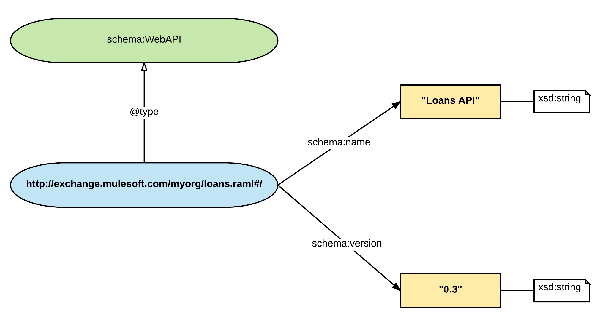
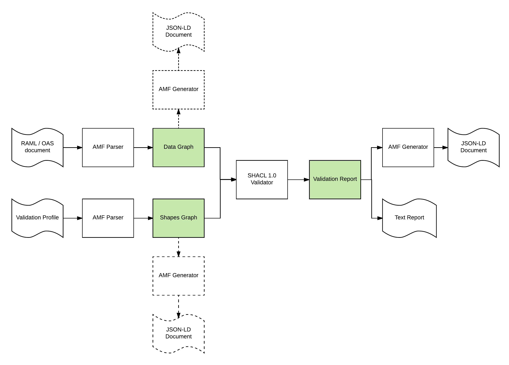
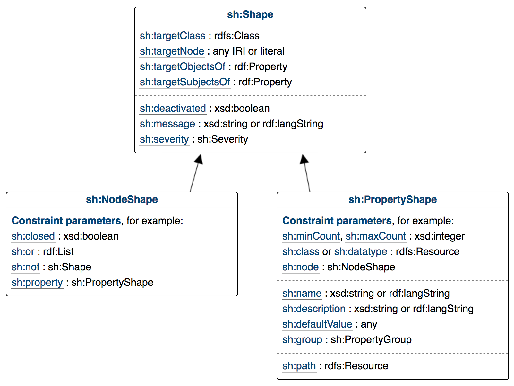

# AMF Validation

## Validation approach

AMF includes a powerful validation framework that can be used to define constraints and validate them over parsed models for HTTP APIs or any other type of RAML document.

AMF validation has the following design goals:

- Validation is explicit

Constraints over the parsed model are explicit. We want to avoid ambiguity about what is valid and invalid for a particular model. All the constraints defined have explicit identifiers and clients can access the full list of validations and their definitions.

- The validation mechanism is formal

AMF uses a W3C recommendation [SHACL](https://www.w3.org/TR/shacl/), to implement validation. SHACL provide powerful and clearly defined closed world semantics to validate information models, beyond what can be achieved through more limited validation schema languages like JSON-Schema. Thanks to SHACL sound logical foundation, we can explain easily why a model is invalid.

- Validations can be customised

AMF introduces the notion of a validation profile. Profiles group validations into sets of related constraints following certain semantics or standard requirements. RAML 1.0, OAS 2.0 are valid profiles that will ensure compatibility between the parsed model and these specifications. Furthermore, clients can create a custom validation profile, selecting the validations that are important for their use case, setting the right severity level for each validation or modifying one of the standard profiles, turning on and off individual validations in that profile.

- Validations can be extended

AMF validation profiles can be extended with custom validations defined by clients. A declarative approach using AMF validation profile dialect can be used to define new validations or a programmatic mechanism based on JavaScript functions can be followed. Advanced users can always define standard SHACL constraints to have complete control over the validation mechanism.

- Validations are data

AMF can parse the validation profile for an API and generate a model in the same way it parses the API definition itself. API model and validation profile model can be linked, stored, and queried as a single unified data graph.

### Validation using data shapes

The main notion in AMF validation is that of a `data shape`.

The output of the AMF parser is a data graph where the nodes in the graph and their relationships capture the information of the input RAML or OAS document.

Data shapes impose restrictions about the valid properties and relationships for the nodes in the parsed data graph, grouped by node type.

For example, the following extract from a RAML document located at `http://exchange.mulesoft.com/myorg/loans.raml`:

```yaml
title: Loans API
version: 0.3
```

Will produce the following data graph:



As we can see in the image, the 'title' RAML property has been parsed and mapped to the [schema-org 'name' property](http://schema.org/name) in the parsed model and the 'version' property has been mapped to the [schema-org 'version' property](http://schema.org/version). At the same time, the main API document located at the root of the document `#/` has been marked as being an [instance of schema-org WebAPI class](https://pending.schema.org/WebAPI).

In order to consider the model encoded in this graph as valid, we might want to impose some restrictions for the nodes in the graph of type `schema:WebAPI`, for example, if certain properties are mandatory or optional, the range of the data type for the properties, etc.
In order to do this, we can define a 'data shape' constraining all instances of the `schema:WebAPI` type. For example, we can make the version mandatory and impose a pattern for the version string. This can be achieved using AMF validation profile syntax in the following way:


```
validations:

  version-constraints:
    message: Version is mandatory and must be a semantic version M.m.r?
    targetClass: schema.WebAPI
    propertyConstraints:
      schema.version:
        minCount: 1
        pattern: "\d+\.\d+(\.\d+)?"
```

This snippet of text declares a new data shape (identified by 'version-constraints') for all instances of the `schema:WebAPI` class where for the `schema.version` property the minimum count of the property must be 1 (making it mandatory) and the value of the property must match the provided regular expression.

AMF validation will parse this data shape definition and validate that the model complies with all the data shapes defined. If some constraints are not met, a validation report including the node in the graph that violates the constraint, the identifier of the violated constraint and property, a descriptive message and information about the location in the input document of the model information violating the constraint will be generated.

### Validation Profiles

In order to use data shapes in any realistic way, a number of data shapes must be defined and re-used together many times to provide a consistency in different RAML documents. We call these sets of related validations 'validation profiles'. AMF allows customers to define validation profiles using a declarative validation syntax.

Additionally, profiles also support the notion of a severity level for each validation, ranging from `VIOLATION` to `INFO`, that can be attached to each specific data shape in the profile.

Profiles can extend other profiles, adding or re-defining validations, changing the severity level or disabling some of the base profile validations.

AMF includes by default 3 validation profiles: [RAML](validations/raml_profile.raml), [OpenAPI](validations/openapi_profile.raml) and [AMF](validations/amf_profile.raml) that follow respectively the constraints defined in the RAML 1.0 specification, OpenAPI 2.0 specification and the common set of validations across both specifications.

For example, the OpenAPI profile defines a validation to make the 'schema:version' property mandatory (identified by amf-parser.mandatory-api-version), but the RAML profile doesn't include this validation since it is not mandatory in RAML.

AMF clients can decide if they want to use the OpenAPI or RAML standard profile, create a custom profile inheriting from each of these but adapting some of the data shapes to their own needs or to create a new validation profile completely from scratch.


### Validation architecture

This section describes the technical details of the AMF validation mechanism. If you are just interested into using the validation mechanism and you are not interested into advanced use cases like using SHACL directly, this section can be safely skipped.

The following diagram shows the main components of the validation mechanism in AMF:



Validation involves two model graphs:

- data graph

Generated after parsing the input RAML/OAS document, containing all the information in the domain model, like the HTTP API

- shapes graph

Generated after parsing a custom or standard validation profile and containing restrictions about the shape of the domain entities in the data graph. Shapes are expressed as SHACL shapes.

The following diagram shows the standard data shapes that can be expressed in SHACL:



Additional shapes can be added to SHACL to define new types of validations. Additionally SHACL also supports JavaScript constraints that can be defined inline as JavaScript code or collected into validation libraries.

Both graphs, the data graph and the shapes graph, can be serialised using AMF as [JSON-LD](https://www.w3.org/TR/json-ld/) documents containing all the information about the graph.

In order to trigger the validation, both graphs are passed to the standard SHACL 1.0 library that will compute the potential violations according to SHACL semantics and generate a validation report as an output data graph.
This report can be serialised as a JSON-LD document that can be processed by machines or as a human-friendly textual report.

## Validation Profile syntax

Validation profile documents are defined as a RAML Dialect extension (see the documentation about RAML Vocabulary and Dialect to know how to work with RAML extensions).

### Header and dialect document type

The header identifying the Validation Profile dialect and the current 1.0 version is:

``` yaml
#%Validation Profile 1.0
```

This header is mandatory in all validation profile documents.


### Profile node

The main node in a Validation Profile document is the Profile node.

These are the possible properties in the node:

| property | description | range | allow multiple values | is map |
| ---      | ---         | ---   | ---                   | ---    |
| profile  | Name for the custom profile | string | false | false |
| description? | Human readable description of the profile | string | false | false |
| extends? | Base profile this profile is extending | string: RAML, OpenAPI, AMF | false | false |
| violation? | List of validations identifiers that will have VIOLATION severity | string | true | true |
| warning? | List of validations identifiers that will have WARNING severity | string | true | false |
| info? | List of validations identifiers that will have INFO severity | string | true | false |
| disabled? | List of validations from the extended profile that will be disabled | string | true | false |
| validations? |  List of custom data shapes defining validations in this profile | ShapeValidation node or FunctionValidation node | - | true |


In order to change the severity level or disable a validation, the identifier of the validation must be added to the right section of the document.
Refer to the list of standard validations defined for each profile to find which validations can be modified.

The following example defines a new profile named `Custom` extending the [RAML standard profile](validations/raml_profile.raml) and disabling the `amf-parser.raml-status-code` validation including in that profile.

``` yaml
#%Validation Profile 1.0

profile: Custom

extends: RAML

disabled:
  - amf-parser.raml-status-code
```

Also note that declaring a validation to the map of `validations` does not automatically enable it. Custom validation must still be added to the section with the right severity level for them to be effective.

Review the Validation Profile documents for the standard profiles to review the list of standard validations and their definitions:

- [AMF](validations/amf_profile.raml)
- [RAML](validations/raml_profile.raml)
- [OpenAPI](validations/openapi_profile.raml)


### ShapeValidation node

Custom data shapes can be defined declaratively as `ShapeValidation` nodes that can be added to the `validations` property in the profile document.

These are the properties of a shape validation:

| property | description | range | alllow multiple values | is map |
| ---      | ---         | ---   | ---                    | ---    |
| message?     | Error message that will be returned in case of a violation | string | false | false |
| targetClass | Identifier of the class in the AMF parsed model the data shape will be validating. It must be a valid class identifier in the model | string | false | false |
| propertyConstraints | map of property constraints for the data shape | PropertyConstriaint node | - | true |

Check the list of target class identifiers to find classes in the AMF model that can be the target of the data shape in the appendix at the end of this document.

Each data shape can contain one or more constraints over properties for the class defined in a property constraint node.

The following example introduces a shape validation redefining the valid values for the status code of a response:

``` yaml
#%Validation Profile 1.0

profile: Custom

extends: RAML

disabled:
  - amf-parser.raml-status-code

violation:
  - my-status-code

validations:

  my-status-code:
    message: Invalid status code value
    targetClass: http.statusCode
    propertyConstraint: hydra.statusCode
    hydra.statusCode:
      pattern: ^(ok|failure|exception)$
```

After adding this constrint and disabling the standard RAML status code validation, the following fragment from RAML document will be valid:

``` yaml
/endpoint:
  get:
    responses:
      ok:
      failure:
      exception:
```

### PropertyConstraint node

Each property constraint node is built as a map with keys targeting properties in the AMF parsed model and the constraints for that property in the model.

The following table defines the constraints that can be used to define the shape of the property in the model:

| property | description | range | alllow multiple values | is map |
| ---      | ---         | ---   | ---                    | ---    |
| pattern? | Regular expression | string | false | false |
| minLength? | Minimum length of a string | integer | false | false |
| maxLength? | Maximum length of a string | integer | false | false |
| maxCount? | Maximum cardinality for the parsed property | integer | false | false |
| minCount? | Minimum cardinality for the parsed property | integer | false | false |
| minExclusive? | Minimum exclusive value for the parsed property | number | false | false |
| maxExclusive? | Maximum exclusive value for the parsed property | number | false | false |
| minInclusive? | Minimum inclusive value for the parsed property | number | false | false |
| maxInclusive? | Maximum inclusive value for the parsed property | number | false | false |
| in? | Enumeration of values allowed for the property | any | true | false |
| range? | Literal range of a property from string, integer, float, anyUri, boolean | false | false |


A single property constraint can have more than one constraint in the map of constraints.


### FunctionValidation node

Alternatively, validations can be defined programmatically using JavaScript functions.

FunctionConstraint nodes are added to the `validations` property by the name of the function constraint and can have the following properties:

| property | description | range | alllow multiple values | is map |
| ---      | ---         | ---   | ---                    | ---    |
| message?     | Error message that will be returned in case of a violation | string | false | false |
| targetClass | Identifier of the class in the AMF parsed model the data shape will be validating. It must be a valid class identifier in the model | string | false | false |
| code? | JavaScript function that will be invoked to check if a violation has happened for the instance of the target class passed as an argument | string | false | false |
| libraries? | URLs pointing to JavaScript files including function definitions that will can be used in the validation | string | true | false |
| functionName? | Name of a function in one of the libraries that will be used to check if a violation has happend for the instance of the target class passed as an argument | string | false | false |

Validation functions must be coded as anonymous functions accepting as single input the node in the model encoded as JSON-LD in expanded form  that is an instance of `targetClass`.
Validation functions must return `true` if no constraint violation is found or `false` to signal a validation error.

#### JS Validation API

AMF validation provides a minimal interface to help build the validation functions:

In order to traverse the model, prefixes for all the namespaces in the model have been defined:

``` json
{
  "raml-shapes":"http://raml.org/vocabularies/shapes#",
  "shacl":      "http://www.w3.org/ns/shacl#",
  "amf-parser": "http://raml.org/vocabularies/amf/parser#",
  "rdfs":       "http://www.w3.org/2000/01/rdf-schema#",
  "doc":        "http://raml.org/vocabularies/document#",
  "data":       "http://raml.org/vocabularies/data#",
  "owl":        "http://www.w3.org/2002/07/owl#",
  "meta":       "http://raml.org/vocabularies/meta#",
  "sourcemaps": "http://raml.org/vocabularies/document-source-maps#",
  "rdf":        "http://www.w3.org/1999/02/22-rdf-syntax-ns#",
  "xsd":        "http://www.w3.org/2001/XMLSchema#",
  "schema":     "http://schema.org/",
  "http":       "http://raml.org/vocabularies/http#",
  "sh":         "http://www.w3.org/ns/shacl#",
  "hydra":      "http://www.w3.org/ns/hydra/core#"
}
```

This means that validation code can use [CURIEs](http://www.w3.org/TR/curie) to traverse the model JSON-LD structure instead of full URIs

For example the following validation targets the requests in the endpoints. In the validation function to get to the headers, we can just use `http:header` instead of the full URI `http://raml.org/vocabularies/http#header`:
Notice that since we are working with the JSON-LD graph in expanded form, the value of a property will always be an array, even if the property has a single value.

``` yaml
validations:

  test-validation:
    message: All requests should have headers
    targetClass: http.Request
    functionConstraint:
      code: |
        function(request) {
          var headers = request[http:header];
          return headers.length > 0;
        }
```

Sometimes we need to traverse the model from the root node using a chain of properties. the `path` function can be used for this. It accepts a sequence of properties and will try to follow the path returning all the accumulated values found for the path.
Paths are expressed as sequences of CURIEs joined by the `/` separator.

For example, imagine we need to modify the previous validation to check that a particular header with a name is present in all the requests. In order to do this, we need to traverse from the http:Request to the header (http:header) and from there to the name of each header (schema:header) and check that the name of the property is present. Instead of nesting loops, we could use the `path` property for this:

``` yaml
validations:

  test-validation:
    message: Header x-token is mandatory in all requests
    targetClass: http.Request
    functionConstraint:
      code: |
        function(request) {
          var pathChain = 'http:header / schema:name';
          var headerNames = path(request, pathChain);
          for (var i=0; i<headerNames.length; i++) {
            if (headerNames[i] === "x-token")
              return true;
          }
        }
```

Validation functions should be stateless, since each validation function is executed independently. However, for certain checks we need to keep state through invocations. In order to accomplish this the validation engine offers a global `accumulators` hash persistent between validation function invocations. Validation functions can use this hash to keep state in order to compute certain restrictrions.

For example, let's imagine we need to create a validation checking that the name of the endpoints (resources in RAML, path items in OpenAPI) are unique. For that we can use the `accumulators` hash to store the names of the endpoints and find duplicated values:

``` yaml
validations:

  unique-identifiers:
    message: Resource names must be unique
    targetClass: http.EndPoint
    functionConstraint:
      code: |
        function(resource) {
          var name = (resource['schema:name'] || [])[0];
          if(accumulators[name] == null) {
            accumulators[name] = true;
            return true;
          } else {
            return false;
          }
        }
```


### Modular Validation Profiles: Libraries

Validation profiles are RAML documents, as such the Validation Profile dialect defines how to split the description into a profile in libraries of data shapes that can be re-used in multiple profiles.

To declare a validation data shapes library, the following header must be used:

``` yaml
#%RAML Library / Validation Profile 1.0
```

In the library validations can be declared using the `shapes` for the ShapeValidation nodes and `functions` for the FunctionValidation nodes.

After being declared, validation libraries can be used in a validation profile document using the `uses` RAML property and providing an alias for the library
Notice that a name for the data shape or function constraint connected to the `validations` property  will still be required to be able to use the data shape.

### Modular Validation Profiles: Typed fragments

In the shame way, data shapes and function constraints can be defined as valid fragments for the Validation Profile dialect and included in a Validation Profile document.

The required headers for the fragments are the following:

| Fragment header | Node type |
| ---             | ---       |
| #%RAML ShapeValidation / Validation Profile 1.0 |  ShapeValidation node |
| #%RAML FunctionValidation / Validation Profile 1.0 |  FunctionValidation node |


## Using AMF validation from the command line

The following section will describe how to use the validation functionality of AMF through the command line, using the AMF executable (java or node versions).
Notice that in all invocations for local file URLs we follow the convention of omitting the hostname, and using `file:///` for absolute paths and `file://` for relative paths to the working directory.

### Default profile validation

To validate an API you can use the `validate` command passing the following arguments:
- `in`: format of the document to parse (RAML, OpenAPI or AMF)
- `p`: default profile to use (RAML, OpenAPI or AMF)

For example for this very simple API:

``` raml
#%RAML 1.0

title: hello api

/hello:
  get:
    responses:
      200:
        body:
          text/plain:
            type: string

```

We could validate it using the RAML standard profile using the following invocation:

``` bash
$ java -jar amf.jar validate -in RAML file://api.raml
```

The output of the invocation will the the JSON-LD document with the serialised graph for the validation report. For example if the validation is successful:

``` json
{
  "@type": "http://www.w3.org/ns/shacl#ValidationReport",
  "http://www.w3.org/ns/shacl#conforms": true
}
```
The exit code of the command can be used to check if the invocation was successful:

``` bash
$ java -jar amf.jar validate -in RAML file://api.raml
{
  "@type": "http://www.w3.org/ns/shacl#ValidationReport",
  "http://www.w3.org/ns/shacl#conforms": true
}
$ echo $?
0
```

If the validation fails, the validation report will include nodes with the information about the failed data shapes and the invocation will return an error code.
For example if we try to validate the same API using the default OpenAPI profile, we will get validation errors about the missing mandatory version:


``` bash
$ java -jar amf.jar validate -in OpenAPI file://api.raml
{
  "@type": "http://www.w3.org/ns/shacl#ValidationReport",
  "http://www.w3.org/ns/shacl#conforms": false,
  "http://www.w3.org/ns/shacl#result": [
    {
      "@type": "http://www.w3.org/ns/shacl#ValidationResult",
      "http://www.w3.org/ns/shacl#resultSeverity": {
        "@id": "http://www.w3.org/ns/shacl#Violation"
      },
      "http://www.w3.org/ns/shacl#focusNode": {
        "@id": "file://api.raml#/web-api"
      },
      "http://www.w3.org/ns/shacl#resultPath": {
        "@id": "http://schema.org/version"
      },
      "http://www.w3.org/ns/shacl#resultMessage": "API Version is Mandatory",
      "http://www.w3.org/ns/shacl#sourceShape": {
        "@id": "http://raml.org/vocabularies/amf/parser#mandatory-api-version"
      },
      "http://raml.org/vocabularies/amf/parser#lexicalPosition": {
        "@type": "http://raml.org/vocabularies/amf/parser#Position",
        "http://raml.org/vocabularies/amf/parser#start": {
          "@type": "http://raml.org/vocabularies/amf/parser#Location",
          "http://raml.org/vocabularies/amf/parser#line": 3,
          "http://raml.org/vocabularies/amf/parser#column": 0
        },
        "http://raml.org/vocabularies/amf/parser#end": {
          "@type": "http://raml.org/vocabularies/amf/parser#Location",
          "http://raml.org/vocabularies/amf/parser#line": 12,
          "http://raml.org/vocabularies/amf/parser#column": 0
        }
      }
    }
  ]
}
$ echo $?
254
```

### Custom profile validation

In order to validate a custom profile, the URL of the validation profile document must be passed to the AMF executable.

For example, let's create a simple validation profile, extending the OpenAPI profile but transforming the data shape that makes the version mandatory (amf-parser:mandatory-api-version) into a simple warning:

``` yaml
#%Validation Profile 1.0

description: example validation profile

profile: Test

extends: OpenAPI

warning: amf-parser.mandatory-api-version
```

We can invoke now the `validate` command passing the custom profile URL using the `cp` argument. The name of the profile is no longer required since the custom profile will be used automatically:


``` bash
$ java -jar amf.jar validate -in RAML -cp file://profile.raml file://api.raml
{
  "@type": "http://www.w3.org/ns/shacl#ValidationReport",
  "http://www.w3.org/ns/shacl#conforms": true,
  "http://www.w3.org/ns/shacl#result": [
    {
      "@type": "http://www.w3.org/ns/shacl#ValidationResult",
      "http://www.w3.org/ns/shacl#resultSeverity": {
        "@id": "http://www.w3.org/ns/shacl#Warning"
      },
      "http://www.w3.org/ns/shacl#focusNode": {
        "@id": "file://api.raml#/web-api"
      },
      "http://www.w3.org/ns/shacl#resultPath": {
        "@id": "http://schema.org/version"
      },
      "http://www.w3.org/ns/shacl#resultMessage": "API Version is Mandatory",
      "http://www.w3.org/ns/shacl#sourceShape": {
        "@id": "http://raml.org/vocabularies/amf/parser#mandatory-api-version"
      },
      "http://raml.org/vocabularies/amf/parser#lexicalPosition": {
        "@type": "http://raml.org/vocabularies/amf/parser#Position",
        "http://raml.org/vocabularies/amf/parser#start": {
          "@type": "http://raml.org/vocabularies/amf/parser#Location",
          "http://raml.org/vocabularies/amf/parser#line": 3,
          "http://raml.org/vocabularies/amf/parser#column": 0
        },
        "http://raml.org/vocabularies/amf/parser#end": {
          "@type": "http://raml.org/vocabularies/amf/parser#Location",
          "http://raml.org/vocabularies/amf/parser#line": 12,
          "http://raml.org/vocabularies/amf/parser#column": 0
        }
      }
    }
  ]
}

$ echo $?
0
```

### Validation and parsing

When parsing a model through the `parse` command, validation will also be triggered automatially by default. If a validation error is found, a textual representation of the validation report will also be emitted through standard error.


``` bash
$ java -jar amf.jar parse -in RAML -p OpenAPI file://api.raml
Model: file://api.raml
Profile: OpenAPI
Conforms? false
Number of results: 1

Level: Violation

- Source: http://raml.org/vocabularies/amf/parser#mandatory-api-version
  Message: API Version is Mandatory
  Level: Violation
  Target: file://api.raml#/web-api
  Property: http://schema.org/version
  Position: Some(LexicalInformation([(3,0)-(12,0)]))
$ echo $?
254
```

Validation can be disable passing the option `v` to false.

### Parsing a validation profile

AMF Validation Profiles are valid RAML dialect documents that can be parsed by default by the AMF parser. This can be accomplished just passing 'RAML' as the input syntax for the AMF parser. The Vocabulary profile dialect is loaded by default in AMF. Check the documentation about RAML Vocabularies and Dialect for more information about how to work with RAML extensions.

``` bash
$ java -jar amf.jar parse -in RAML profile.raml

[
  {
    "@id": "file://profile.raml",
    "@type": [
      "http://raml.org/vocabularies/document#Document",
      "http://raml.org/vocabularies/document#Fragment",
      "http://raml.org/vocabularies/document#Module",
      "http://raml.org/vocabularies/document#Unit"
    ],
    "http://raml.org/vocabularies/document#encodes": [
      {
        "@id": "file://profile.raml#",
        "@type": [
          "http://raml.org/vocabularies/amf-validation#Profile"
        ],
        "http://schema.org/name": [
          {
            "@value": "Test"
          }
        ],
        "http://schema.org/description": [
          {
            "@value": "example validation profile"
          }
        ],
        "http://raml.org/vocabularies/amf-validation#extendsProfile": [
          {
            "@value": "OpenAPI"
          }
        ],
        "http://raml.org/vocabularies/amf-validation#setSeverityWarning": [
          {
            "@value": "amf-parser.mandatory-api-version"
          }
        ]
      }
    ]
  }
]
```


## Using AMF validation programmatically

When using AMF as a library, validation can be used throught the `reportValidation` and `reportCustomValidation` methods available in every AMF parser class (RamlParser, OasParser and AmfParser).

The following Java snippet shows how to invoke programmatically the validation over the examples defined previously to be tested from the command line:

``` java
package mulesfot.amf;

import amf.client.RamlParser;
import amf.validation.AMFValidationReport;

import java.util.concurrent.ExecutionException;

import static java.lang.System.out;

public class ValidationTest {

  public static void main(String[] args) throws ExecutionException, InterruptedException {

    final RamlParser parser = new RamlParser();

    parser.parseFileAsync("file://validation/api.raml").get();

    // Default RAML validation
    final AMFValidationReport ramlReport = parser.reportValidation("RAML").get();

    final AMFValidationReport oasReport = parser.reportValidation("OpenAPI").get();

    final AMFValidationReport customReport = parser.reportCustomValidation("Test", "file://validation/profile.raml").get();

    // Check the results
    assert(ramlReport.conforms());
    out.println("API conforms to RAML profile");
    out.println(ramlReport);

    assert(!oasReport.conforms());
    out.println("API does not conform to OpenAPI profile");
    out.println(oasReport);

    assert(!customReport.conforms());
    out.println("API conforms to the custom profile, but with a warning");
    out.println(customReport);
  }
}
```

Both functions produce a `AMFValidationReport` object that can be used to check conformance and inspect the validations.
The interface is the same in the JavaScript version of the library.


## Appendix: AMF model classes

| AMF Class | RAML 1.0 node | OpenAPI 2.0 object |
| ---       | ---       | ---          |
| raml-doc.DomainElement | -  | - |
| schema.WebAPI | Root node | Swagger object |
| schema.Organization | - | Contact object |
| http.EndPoint | Resource node | PathItem object |
| hydra.Operation | Method node | Operation object |
| http.Request | Method node (request info) | Operation object (request info) |
| http.Response | Response node | Response object |
| http.Parameter | Parameters, headers and query string nodes | Parameter and header object |
| http.Payload | Response node (payload info) | Response object (payload info) |
| raml-shapes.Shape | RAML Type node | Schema object |
| raml-shapes.XMLSerializer | XML serializer node | XML object |
| raml-shapes.ObjectShape | RAML object type | Object schema object |
| raml-shapes.UnionShape | RAML union type | anyOf Object schema object |
| raml-shapes.ArrayShape | RAML array type | Array schema object |
| raml-shapes.ScalarShape | RAML scalar type | Scalar schema object |

## Appendix: AMF model properties

| AMF Property | RAML 1.0 property | OpenAPI 2.0 property |
| ---          | ---               | ---                  |
| schema.name | - | name, title, displayName | name, title |
| schema.description | - | description | description |
| http.host | baseUri (host part) | schemes |
| http.basePath | baseUri (path part) | basePath |
| http.accepts | mediaType | consumes |
| http.mediaType | mediatype | produces |
| schema.version | version | version |
| schema.termsOfService | (termsOfService) | termsOfService |
| schema.provider | (contact) | contact |
| http.endpoint | - | paths |
| http.parameter | baseUriParameters, uriParameters, queryParameters, headers | parameters, headers |
| schema.url | url | url |
| schema.email | email | email |
| http.path | resource path property value | paths object key value |
| hydra.method | method node key value | Operation object key value |
| raml-doc.deprecated | (deprecated) | deprecated |
| hydra.returns | responses | responses |
| http.header | headers | headers, parameters (in header) |
| hydra.statusCode | responses key value | responses object key value |
| hydra.required | required | required |
| http.binding | - | in |
| http.schema | type, schema | schema |
| http.mediaType | body key value | produces |
| raml-shapes.xmlSerialization | xml | xml |
| shacl.in | enum | enum |
| raml-shapes.xmlAttribute | attribute | attribute |
| raml-shapes.xmlWrapped | wrapped | wrapped |
| raml-shapes.xmlName | name | name |
| raml-shapes.xmlNamespace | namespace | namespace |
| raml-shapes.xmlPrefix | prefix | prefix |
| raml-shapes.minProperties | minProperties | minProperties |
| raml-shapes.maxProperties | maxProperties | maxProperties |
| shacl.closed | additionalProperties | additionalProperties |
| raml-shapes.discriminator | discriminator | discriminator |
| raml-shapes.discriminatorValue | discriminatorValue | x-discriminator-value |
| raml-shapes.readOnly | (readOnly) | readOnly |
| raml-shapes.item | items | items |
| shacl.minCount | minCount | minCount |
| shacl.maxCount | maxCount | maxCount |
| raml-shapes.uniqueItems | uniqueItems | uniqueItems |
| shacl.pattern | pattern | pattern |
| shacl.minLength | minLength | minLength |
| shacl.maxLength | maxLength | maxLength |
| shacl.minInclusive | minimum | minInclusive |
| shacl.maxInclusive | maximum | maxInclusive |
| shacl.minExclusive | (exclusiveMinimum) | exclusiveMinimum |
| shacl.maxExclusive | (exclusiveMaximum) | exclusiveMaximum |
| raml-shapes.format | format | format |
| raml-shapes.multipleOf | multipleOf | multipleOf |
